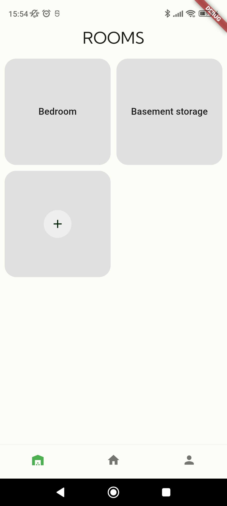
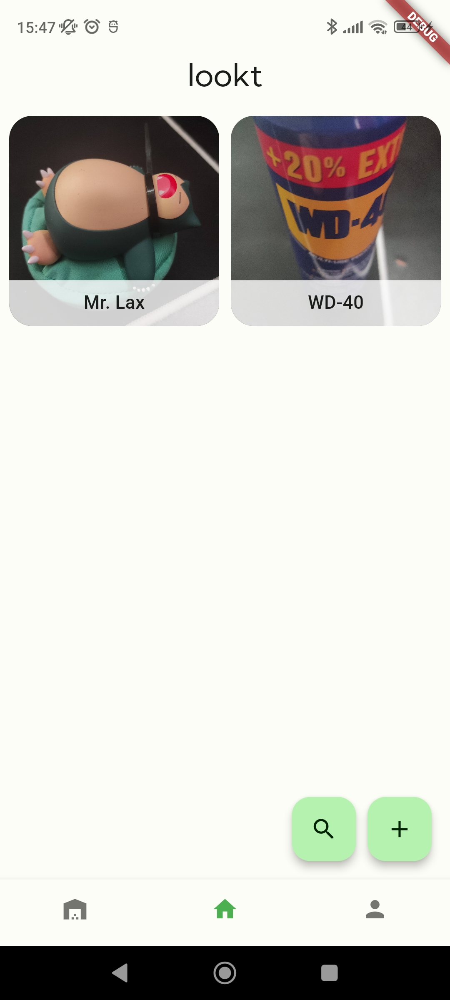

# Lookt

## Design
### List of Rooms


### List of Items in Room


### Add Item


--------------------------------------------------------------------------------------------

## Nix
```sh
git clone https://github.com/sebastos1/ikt205
cd ikt205
nix develop
flutter run
```

When changing the local database, do:
```sh
dart run build_runner build
```

## if wsl
on windows:
```bash
adb tcpip 5555
```
on wsl:
```bash
adb connect <device-ip>:5555
```

## AppChecker
To pass the AppChecker while debugging the code will output a key while booting:
```bash
Enter this debug secret into the allow list in the Firebase Console for your project: 849bac02-d07d-4eba-9bb7-d7c89c0c6b18
```
Go to firebase console > App Check > Apps. Then click the 3 dots to the right of app(Android) and click Manage debug tokens. Give the token a name and paste the key outputed. When added the key this will be valid until you would delete cache and storage from the app.
